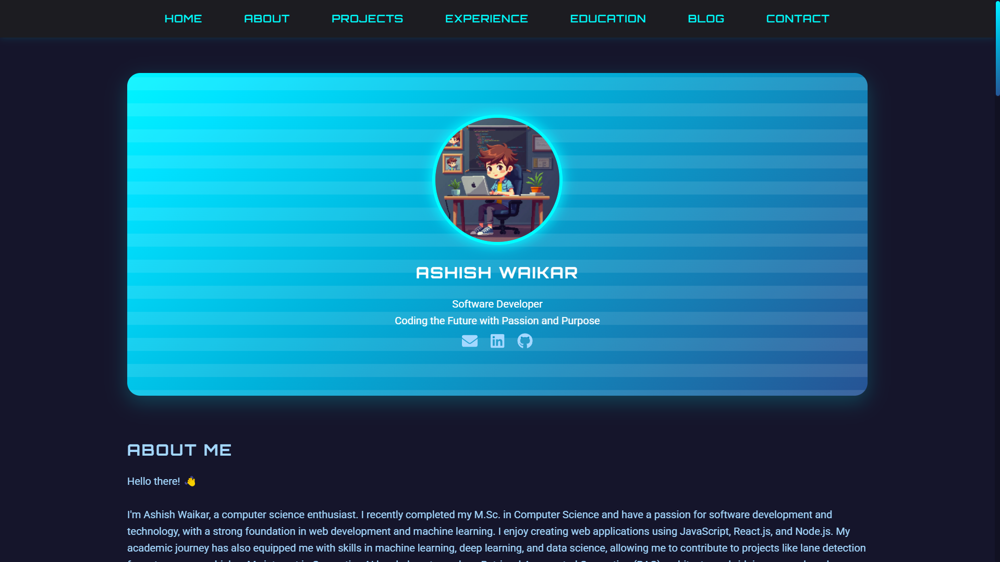

## My portfolio website

This is my personal portfolio website showcasing my skills, projects, and experience. The website is built using HTML, CSS, JavaScript and flask (Python) with a focus on responsive design and user experience. It includes sections such as About Me, Projects, Experience, Education, and Contact. The Projects section highlights some of my key projects with descriptions, technologies used, and links to live demos and GitHub repositories. The website also features my blog posts where I share my thoughts on various tech topics.

### Project page of portfolio

